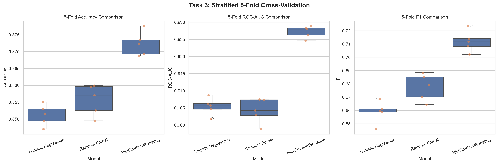
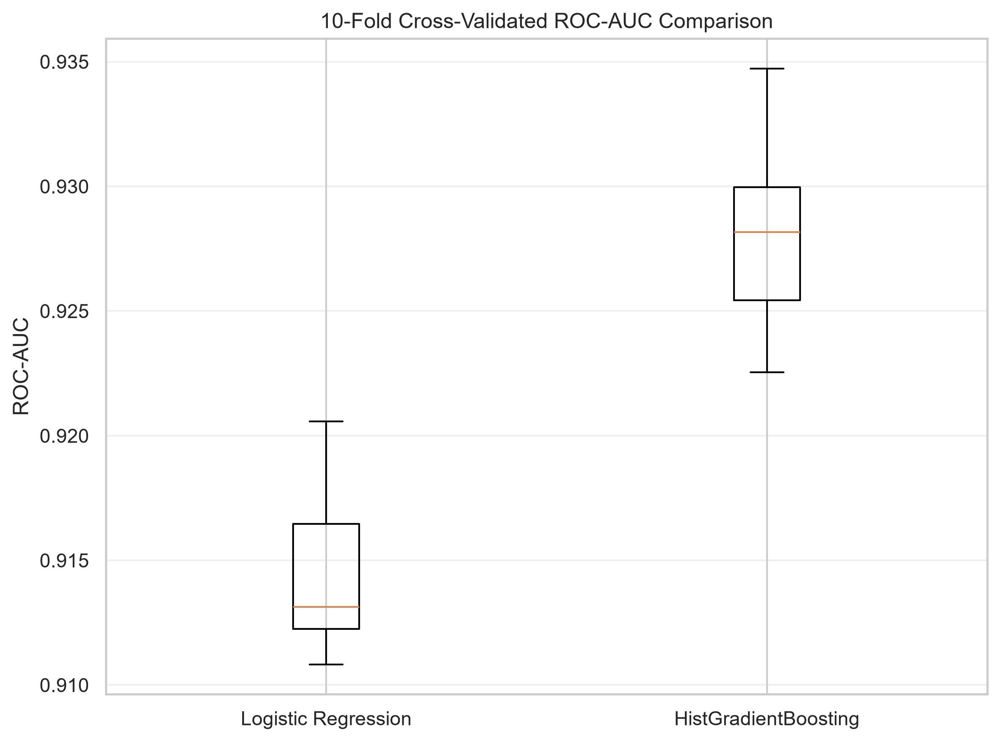

# Web3Geeks Machine Learning Internship — Week 1 Day 3
**Repository:** [internship_web3geeks](https://github.com/armishiqbal/internship_web3geeks)  
**Deliverable Notebook:** [`day3.ipynb`](day3.ipynb)  
**Deliverable Executive Report:** [`day3_summary_report.pdf`](day3_summary_report.pdf) *(Strictly 2 Pages)*

---

## 📁 Day 3 Directory Structure

```text
├── week 1/
│   └── day 3/
│       ├── day3.ipynb                                     # ⭐ Primary Jupyter Notebook Deliverable (Tasks 1–5)
│       ├── day3_summary_report.pdf                        # ⭐ Executive 2-Page Summary Report (PDF Deliverable)
│       ├── generate_day3_pdf.py                           # Automated ReportLab Script for 2-Page PDF
│       ├── README.md                                      # ⭐ Comprehensive Day 3 Documentation & Benchmarks
│       ├── adults.csv                                     # Canonical UCI Adult Dataset (32,561 rows)
│       ├── task3_5fold_boxplots.png                       # 5-Fold CV Metric Boxplots (Acc, ROC-AUC, F1)
│       ├── task3_cv_results.csv                           # 5-Fold Cross-Validation Summary Metrics Table
│       ├── task3_fold_scores.csv                          # Per-Fold Metric Records (Folds 1–5)
│       ├── task4_10fold_roc_auc_boxplot.png               # 10-Fold Paired ROC-AUC Boxplot (HGB vs LR)
│       ├── task4_fold_roc_auc_scores.csv                  # 10-Fold Paired Scores (LR vs HGB)
│       ├── task4_statistical_comparison.csv               # Paired t-test & Wilcoxon Test Results
│       ├── task4_histgradientboosting_feature_importance.csv # Permutation Importances (HGB)
│       ├── task4_all_logistic_coefficients.csv            # All 123 Logistic Regression Coefficients
│       ├── task4_logistic_engineered_coefficients.csv     # Engineered Feature Logistic Weights & Odds Ratios
│       ├── task4_engineered_feature_summary.csv           # Summary Comparison of Engineered Feature Impacts
│       └── task5_feature_selection_benchmark.csv          # L1 Sparsity & Feature Selection Benchmarks
```

---

## 🛠️ Task 1: Principled Feature Engineering Strategy

Tabular census data exhibits non-linear relationships, heavy monetary zero-inflation ($>90\%$ zeros), demographic lifecycle trajectories, and multiplicative returns on education. We engineered **$8$ domain-principled features** strictly at the row level with **zero target leakage**:

### Feature Dictionary & Univariate Predictive Signals

| Feature Name | Type | Creation Rule (Zero-Leakage) | Domain Rationale / Economic Logic | Mutual Info ($I(X; Y)$) | Univariate Signal ($P(>\$50\text{K})$) |
| :--- | :---: | :--- | :--- | :---: | :--- |
| **`is_married`** | Binary Flag | `marital_status in {Civ-Spouse, AF-Spouse}` | Dual-earner pooling, tax brackets, career lifecycle stability. | **$0.1105$** | Non-Married: **$6.5\%$**<br/>Married: **$44.7\%$** ($6.9\times$ lift) |
| **`edu_x_hours`** | Numeric Interaction | `education_num * hours_per_week` | Captures compounding marginal wage returns per hour for educated workers. | **$0.0840$** | Q1: **$6.2\%$** \| Q2: **$16.4\%$**<br/>Q3: **$30.0\%$** \| Q4: **$52.2\%$** |
| **`log_capital_gain`** | Log Numeric | `np.log1p(capital_gain)` | Dampens extreme right-skewed tail ($\$0 \rightarrow \$99,999$), stabilizing linear separation. | **$0.0824$** | Zero: **$20.7\%$** \| Mid: **$89.9\%$**<br/>High: **$98.8\%$** |
| **`age_bucket`** | Categorical | `pd.cut(age, [0, 24, 34, 44, 54, 64, 200])` | Models non-monotonic human earning curve peaking in mid-to-late career stages. | **$0.0631$** | $<25$: **$1.1\%$** \| $25\text{–}34$: **$16.8\%$**<br/>$45\text{–}54$: **$40.1\%$** \| $65+$: **$20.7\%$** |
| **`is_higher_ed`** | Binary Flag | `education in {Bachelors, Masters, Prof, Doc}` | Isolates step-function wage credential premium over standard secondary schooling. | **$0.0494$** | Non-Higher: **$16.1\%$**<br/>Higher Ed: **$48.5\%$** ($3.0\times$ lift) |
| **`hours_bin`** | Categorical | `pd.cut(hours, [-1, 20, 35, 40, 50, 200])` | Distinguishes non-linear part-time ($<20$), standard ($40\text{h}$), and extreme overtime pay tiers. | **$0.0385$** | Part-time: **$6.7\%$** \| Standard: **$21.1\%$**<br/>Overtime: **$39.6\%$** \| Extreme: **$41.3\%$** |
| **`has_capital_gain`** | Binary Flag | `(capital_gain > 0).astype(int)` | Separates asset holders from non-investors given $91.7\%$ base zero rate. | **$0.0323$** | No Gain: **$20.7\%$**<br/>Has Gain: **$61.8\%$** ($3.0\times$ lift) |
| **`has_capital_loss`** | Binary Flag | `(capital_loss > 0).astype(int)` | Indicator of active portfolio management & liquid market participation. | **$0.0098$** | No Loss: **$22.8\%$**<br/>Has Loss: **$50.9\%$** ($2.2\times$ lift) |

---

## 🤖 Task 2: Advanced Preprocessing Pipeline Architecture

We constructed a leak-free `sklearn` pipeline architecture integrating the engineered features:

1. **Row-by-Row Transformer (`FeatureEngineer` / `FunctionTransformer`):**  
   Transforms raw records without computing column-wide or out-of-row statistics.
2. **`ColumnTransformer` Decomposition:**
   * **Numeric Sub-Pipeline ($12$ columns):**  
     `SimpleImputer(strategy='median')` $\rightarrow$ `StandardScaler()`  
     Columns: `age`, `fnlwgt`, `education_num`, `capital_gain`, `capital_loss`, `hours_per_week`, `log_capital_gain`, `edu_x_hours`, `has_capital_gain`, `has_capital_loss`, `is_higher_ed`, `is_married`.
   * **Categorical Sub-Pipeline ($10$ columns):**  
     `SimpleImputer(strategy='most_frequent')` $\rightarrow$ `OneHotEncoder(handle_unknown='ignore', sparse_output=False)`  
     Columns: `workclass`, `education`, `marital_status`, `occupation`, `relationship`, `race`, `sex`, `native_country`, `age_bucket`, `hours_bin`.
3. **Dimensionality:** Raw ($14$) + Engineered ($8$) $\rightarrow$ **$123$ transformed columns**.
4. **Strict Zero-Leakage Guarantee:** All estimators and encoders are fitted strictly within training partitions during cross-validation. No target encoding is applied.

---

## 📊 Task 3: 5-Fold Stratified Cross-Validation Benchmark

We evaluated three diverse model families across identical $5$-fold stratified cross-validation splits ($N = 32,561$):

| Model Architecture | Accuracy (Mean $\pm$ Std) | ROC-AUC (Mean $\pm$ Std) | $F_1$-Score (Mean $\pm$ Std) | Behavioral Assessment |
| :--- | :---: | :---: | :---: | :--- |
| **HistGradientBoosting** | **$0.8723 \pm 0.0032$** | **$0.9272 \pm 0.0016$** | **$0.7120 \pm 0.0070$** | **Strict Top Performer.** Lowest variance across folds; captures non-linear interactions natively. |
| **Random Forest ($100$ trees)** | $0.8557 \pm 0.0041$ | $0.9042 \pm 0.0032$ | $0.6775 \pm 0.0090$ | Strong recall but lower ROC-AUC precision; higher fold variance. |
| **Logistic Regression ($L_2$)** | $0.8512 \pm 0.0028$ | $0.9055 \pm 0.0022$ | $0.6589 \pm 0.0073$ | Fast linear baseline; constrained by linear separation boundary. |

### Per-Fold Performance Breakdown (5-Fold CV)

| Fold | Logistic Regression ($F_1$ / AUC) | Random Forest ($F_1$ / AUC) | HistGradientBoosting ($F_1$ / AUC) |
| :---: | :---: | :---: | :---: |
| **Fold 1** | $0.6589$ / $0.9058$ | $0.6793$ / $0.9028$ | **$0.7141$** / **$0.9280$** |
| **Fold 2** | $0.6596$ / $0.9087$ | $0.6850$ / $0.9075$ | **$0.7117$** / **$0.9284$** |
| **Fold 3** | $0.6461$ / $0.9046$ | $0.6703$ / $0.9042$ | **$0.7022$** / **$0.9263$** |
| **Fold 4** | $0.6611$ / $0.9019$ | $0.6644$ / $0.8988$ | **$0.7083$** / **$0.9246$** |
| **Fold 5** | $0.6688$ / $0.9063$ | $0.6885$ / $0.9074$ | **$0.7236$** / **$0.9289$** |



---

## 🔬 Task 4: In-Depth Comparison & Statistical Significance Testing

### 1. 10-Fold CV Paired Hypothesis Testing (HGB vs. Logistic Regression)

To verify whether HistGradientBoosting's margin is statistically dependable and practically meaningful, parametric and non-parametric paired tests were executed across $10$ identical stratified folds:

* **Mean ROC-AUC (Logistic Regression):** $0.9143 \pm 0.0032$
* **Mean ROC-AUC (HistGradientBoosting):** $0.9280 \pm 0.0036$
* **Mean ROC-AUC Difference ($\Delta$):** **$+0.0138$** ($+1.38\%$ absolute AUC gain)
* **Paired Student's $t$-test:** $t = 33.45$, $p = 9.41 \times 10^{-11}$ ($p \ll 0.001$, Reject $H_0$)
* **Wilcoxon Signed-Rank Test:** $W = 0.0$, $p = 0.00195$ ($p < 0.01$, Reject $H_0$)
* **Head-to-Head Win Record:** **HistGradientBoosting won 10 out of 10 folds (0 ties, 0 losses)**.
* **Practical Interpretation:** The $+1.38\%$ AUC and $+5.3\%$ $F_1$ gain is practically meaningful: in customer acquisition and credit risk scoring, this prevents hundreds of false positives while capturing high-earning prospects.



### 2. Feature Importance & Interpretability Analysis

* **HistGradientBoosting Permutation Importance:**
  1. `marital_status`: **$0.0910 \pm 0.0019$** (Root split driver)
  2. `age`: **$0.0574 \pm 0.0007$** (Career lifecycle)
  3. `capital_gain`: **$0.0564 \pm 0.0010$** (Liquid wealth indicator)
  4. `education_num`: **$0.0376 \pm 0.0005$** (Educational credential)
  5. `edu_x_hours` *(Engineered)*: **$0.0237 \pm 0.0004$** (Dominant engineered feature, capturing hourly returns on education)
  6. `hours_per_week`: **$0.0166 \pm 0.0002$**
  7. `occupation`: **$0.0149 \pm 0.0006$**

* **Logistic Regression Engineered Feature Coefficients & Odds Ratios:**
  * `log_capital_gain`: **$+5.1703$** ($\text{Odds Ratio} = 176.0$) — Dominant linear driver for investors.
  * `has_capital_gain`: **$-5.0027$** ($\text{Odds Ratio} = 0.0067$) — Intercept calibration offset for non-investors.
  * `age_bucket_65+`: **$-1.0890$** ($\text{Odds Ratio} = 0.337$) — Post-retirement income drop.
  * `age_bucket_<25`: **$-1.0505$** ($\text{Odds Ratio} = 0.350$) — Entry-level wage suppression.
  * `hours_bin_reduced`: **$-1.0023$** ($\text{Odds Ratio} = 0.367$) — Part-time wage penalty.
  * `hours_bin_extreme`: **$+0.6055$** ($\text{Odds Ratio} = 1.832$) — High-intensity overtime bonus.
  * `age_bucket_45-54`: **$+0.5509$** ($\text{Odds Ratio} = 1.735$) — Peak earning career stage.
  * `is_married`: **$+0.4369$** ($\text{Odds Ratio} = 1.548$) — Dual-income household stability.

---

## ⚡ Task 5: Feature Selection via L1 Sparsity Benchmark

We embedded $L_1$-penalized feature selection (`SelectFromModel(LogisticRegression(penalty='l1', solver='liblinear'))`) inside the cross-validated pipeline to evaluate the dimensionality-latency-performance trade-off:

| Configuration | Original Features | Transformed Features | Retained Features | Accuracy (Mean $\pm$ Std) | ROC-AUC (Mean $\pm$ Std) | $F_1$-Score (Mean $\pm$ Std) | CV Wall Time |
| :--- | :---: | :---: | :---: | :---: | :---: | :---: | :---: |
| **Full Feature Set (All)** | $14$ | $123$ | **$123$ ($100\%$)** | **$0.8742 \pm 0.0036$** | **$0.9283 \pm 0.0016$** | **$0.7154 \pm 0.0080$** | **$7.92\text{s}$** |
| **Moderate $L_1$ ($C=0.1$)** | $14$ | $123$ | **$49$ ($39.8\%$)** | $0.8739 \pm 0.0037$ | **$0.9283 \pm 0.0015$** | $0.7143 \pm 0.0084$ | $8.84\text{s}$ ($+0.92\text{s}$) |
| **Aggressive $L_1$ ($C=0.01$)** | $14$ | $123$ | **$18$ ($14.6\%$)** | $0.8686 \pm 0.0022$ | $0.9249 \pm 0.0023$ | $0.6983 \pm 0.0061$ | **$2.88\text{s}$ ($2.75\times$ faster)** |

### Architectural Decision & Day 4 Hyperparameter Tuning Plan
1. **Selected Model:** `HistGradientBoostingClassifier` — Statistically superior across both parametric ($p = 9.41 \times 10^{-11}$) and non-parametric ($p = 0.00195$) tests with a $10\text{–}0$ win record over Logistic Regression and a $+2.3\%$ ROC-AUC advantage over Random Forest.
2. **Selected Feature Representation:** `Full Feature Set (All 123 features)` — Preserves peak ROC-AUC ($0.9283$) and $F_1$ ($0.7154$). Moderate $L_1$ preserved AUC but increased wall time ($8.84\text{s}$ vs $7.92\text{s}$) due to selector fitting overhead. Aggressive $L_1$ accelerated training but sacrificed $0.34\%$ AUC and $1.71\%$ $F_1$. Since tree-based histogram gradient boosting natively performs greedy feature coordinate splits, the full representation maximizes interaction discovery with zero computational penalty.
3. **Day 4 Tuning Search Grid:**
   * `learning_rate`: `[0.03, 0.05, 0.10, 0.15]`
   * `max_leaf_nodes`: `[15, 31, 63, 127]`
   * `min_samples_leaf`: `[20, 50, 100]`
   * `l2_regularization`: `[0.0, 0.5, 1.0, 5.0]`
   * `max_iter`: Early stopping with `tolerance=1e-4`

---

## 💻 How to Run Day 3 Deliverables

### 1. Interactive Jupyter Notebook
```bash
jupyter notebook "week 1/day 3/day3.ipynb"
```
Or open [`day3.ipynb`](day3.ipynb) directly in VS Code / Cursor and select the Python kernel.

### 2. Generate / Re-render 2-Page Executive Summary PDF
```bash
python generate_day3_pdf.py
```
Outputs [`day3_summary_report.pdf`](day3_summary_report.pdf) (strictly 2 pages, verified with `pypdf`).

### 3. Inspect Benchmark CSVs & Plots
All experimental artifacts are available directly in this directory:
* [`day3_summary_report.pdf`](day3_summary_report.pdf) (Executive 2-Page PDF)
* [`task3_cv_results.csv`](task3_cv_results.csv)
* [`task4_statistical_comparison.csv`](task4_statistical_comparison.csv)
* [`task5_feature_selection_benchmark.csv`](task5_feature_selection_benchmark.csv)
* [`task3_5fold_boxplots.png`](task3_5fold_boxplots.png)
* [`task4_10fold_roc_auc_boxplot.png`](task4_10fold_roc_auc_boxplot.png)
