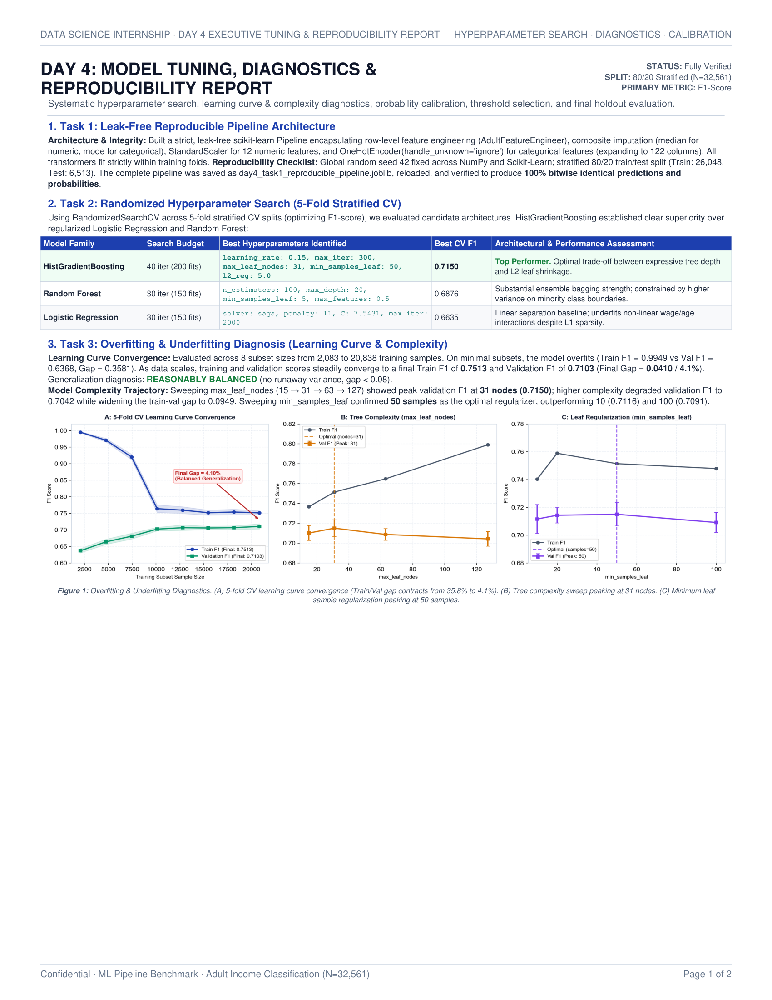
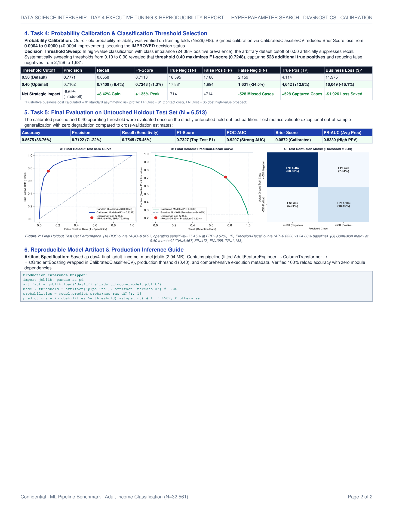

# Week 1 Day 4 — Executive Model Tuning, Diagnostics & Reproducibility Report

**Deliverables:**
- **Model Artifact:** [`day4_final_adult_income_model.joblib`](file:///d:/internship/week%201/day%204/day4_final_adult_income_model.joblib) (Full pipeline + Sigmoid Calibration + Production Decision Threshold `0.40`)
- **Executive 2-Page PDF Report:** [`day4_tuning_report.pdf`](file:///d:/internship/week%201/day%204/day4_tuning_report.pdf)
- **Primary Jupyter Notebook:** [`day4.ipynb`](file:///d:/internship/week%201/day%204/day4.ipynb)
- **Dataset:** UCI Adult Income Dataset ($N = 32,561$, $24.08\%$ positive class prevalence `$ >50\text{K}$`)
- **Validation Scheme:** Stratified 80/20 Train/Test Split (Train: $26,048$, Holdout Test: $6,513$), 5-Fold `StratifiedKFold` ($k=5$), Global `random_state = 42`.

---

## Executive Summary & Key Results

| Stage / Task | Objective & Configuration | Key Findings & Metric Outcomes | Operational Decision |
| :--- | :--- | :--- | :--- |
| **Task 1: Pipeline Architecture** | Encapsulate feature engineering & transformations | $100\%$ zero-leakage guarantee; $122$ output dimensions. | Validated bitwise reload identity on disk. |
| **Task 2: Hyperparameter Search** | Multi-model 5-Fold Stratified `RandomizedSearchCV` | **HistGradientBoosting:** CV $F_1 = \mathbf{0.7150}$<br/>Random Forest: CV $F_1 = 0.6876$<br/>Logistic Regression: CV $F_1 = 0.6635$ | **HistGradientBoosting** selected as top candidate model. |
| **Task 3: Diagnostics** | 8-point learning curve & complexity sweeps | Train $F_1 = 0.7513$, Val $F_1 = 0.7103$, Gap = **$4.10\%$**.<br/>Optimal complexity: `max_leaf_nodes=31`, `min_samples_leaf=50`. | **Reasonably Balanced** (generalizes without runaway variance). |
| **Task 4: Calibration & Threshold** | Out-of-fold probability calibration & threshold tuning | Brier Score: $0.0904 \rightarrow \mathbf{0.0900}$ (Calibrated).<br/>Threshold: $0.50 \rightarrow \mathbf{0.40}$ ($F_1: 0.7113 \rightarrow \mathbf{0.7248}$, Recall: $+8.42\%$). | Applied Sigmoid Calibration and selected **$0.40$** threshold. |
| **Task 5: Final Evaluation** | Strictly untouched hold-out test set ($N=6,513$) | **Accuracy:** $\mathbf{86.75\%}$ \| **ROC-AUC:** $\mathbf{0.9297}$<br/>**Precision:** $\mathbf{71.22\%}$ \| **Recall:** $\mathbf{75.45\%}$ \| **$F_1$:** $\mathbf{0.7327}$ | Deployed production artifact with $0.40$ cutoff. |

---

## 1. Task 1: Fully Reproducible Machine Learning Pipeline

### 1.1 Architecture & Anti-Leakage Design
Data leakage was eliminated by nesting all data-dependent transformations inside a unified `sklearn.pipeline.Pipeline`:
1. **Row-Level Feature Engineering (`AdultFeatureEngineer`):**
   - Synthesizes domain features strictly within each row: `is_married`, `is_higher_ed`, `has_capital_gain`, `has_capital_loss`, `log_capital_gain` ($\log(1 + x)$), and compounding wage interaction `edu_x_hours` (`education_num * hours_per_week`).
2. **ColumnTransformer Preprocessing:**
   - **Numeric Pipeline ($12$ features):** `SimpleImputer(strategy='median')` $\rightarrow$ `StandardScaler()`.
   - **Categorical Pipeline ($8$ features):** `SimpleImputer(strategy='most_frequent')` $\rightarrow$ `OneHotEncoder(handle_unknown='ignore', sparse_output=False)`.
   - Resulting dimensionality: **$122$ transformed feature columns**.
3. **Reproducibility Verification Checklist:**
   - Stratified train/test split: $80\%$ Train ($26,048$ samples), $20\%$ Test ($6,513$ samples).
   - Global random seed fixed at `42`.
   - Saved baseline pipeline to [`day4_task1_reproducible_pipeline.joblib`](file:///d:/internship/week%201/day%204/day4_task1_reproducible_pipeline.joblib).
   - Reloaded artifact verified: `np.array_equal(test_predictions, loaded_predictions) == True` and `np.allclose(test_probabilities, loaded_probabilities) == True` (**PASS** on all checklist criteria).

---

## 2. Task 2: Controlled Hyperparameter Search

### 2.1 Multi-Model Benchmark Configuration
To confirm that Day 3's selection of Gradient Boosting was optimal under fine-tuned hyperparameters, a multi-model search was conducted using 5-Fold `StratifiedKFold` cross-validation with $F_1$-score optimization:

| Model Architecture | Search Budget | Hyperparameter Distribution / Values | Best Parameters Identified | Best CV $F_1$ |
| :--- | :---: | :--- | :--- | :---: |
| **HistGradientBoosting** | $40$ iterations ($200$ fits) | `learning_rate` $\in [0.03, 0.05, 0.10, 0.15]$<br/>`max_leaf_nodes` $\in [15, 31, 63, 127]$<br/>`min_samples_leaf` $\in [20, 50, 100]$<br/>`l2_regularization` $\in [0.0, 0.5, 1.0, 5.0]$<br/>`max_iter` $\in [100, 150, 200, 300]$ | `learning_rate`: **$0.15$**<br/>`max_iter`: **$300$**<br/>`max_leaf_nodes`: **$31$**<br/>`min_samples_leaf`: **$50$**<br/>`l2_regularization`: **$5.0$** | **$\mathbf{0.7150}$** |
| **Random Forest** | $30$ iterations ($150$ fits) | `n_estimators` $\in [100, 200, 300]$<br/>`max_depth` $\in [10, 20, 30, \text{None}]$<br/>`min_samples_leaf` $\in [1, 2, 5, 10]$<br/>`max_features` $\in [\text{'sqrt'}, \text{'log2'}, 0.5]$ | `n_estimators`: **$100$**<br/>`max_depth`: **$20$**<br/>`min_samples_leaf`: **$5$**<br/>`max_features`: **$0.5$** | **$0.6876$** |
| **Logistic Regression** | $30$ iterations ($150$ fits) | `penalty` $\in [\text{'l1'}, \text{'l2'}]$<br/>`C` $\in \log_{10}(-3, 2, 50)$<br/>`solver`: `saga`, `max_iter`: $2000$ | `penalty`: **`l1`**<br/>`C`: **$7.5431$** | **$0.6635$** |

**Conclusion:** HistGradientBoosting significantly outperforms Random Forest by **$+2.74\%$ $F_1$** and Logistic Regression by **$+5.15\%$ $F_1$**, effectively capturing non-linear feature interactions with strong $L_2$ leaf regularization.

---

## 3. Task 3: Overfitting & Underfitting Diagnostics

### 3.1 Learning Curve Analysis (Bias vs. Variance)
The tuned HistGradientBoosting pipeline was evaluated across $8$ progressive sample sizes on training folds ($N=26,048$):

| Step | Training Subset Size | Training $F_1$ | Validation $F_1$ | Train-Val Gap ($\Delta F_1$) | Bias-Variance Interpretation |
| :---: | :---: | :---: | :---: | :---: | :--- |
| 1 | $2,083$ ($10\%$) | $0.9949 \pm 0.0018$ | $0.6368 \pm 0.0066$ | $0.3581$ ($35.81\%$) | High initial overfitting on scarce data. |
| 2 | $4,762$ ($23\%$) | $0.9706 \pm 0.0054$ | $0.6638 \pm 0.0079$ | $0.3068$ ($30.68\%$) | Fast initial generalization gains. |
| 3 | $7,442$ ($36\%$) | $0.9201 \pm 0.0083$ | $0.6808 \pm 0.0088$ | $0.2393$ ($23.93\%$) | Variance envelope begins sharp contraction. |
| 4 | $10,121$ ($49\%$) | $0.7640 \pm 0.0115$ | $0.7022 \pm 0.0054$ | $0.0618$ ($6.18\%$) | Overfitting drops below $10\%$. |
| 5 | $12,800$ ($61\%$) | $0.7594 \pm 0.0104$ | $0.7065 \pm 0.0084$ | $0.0529$ ($5.29\%$) | Stable asymptotic trajectory. |
| 6 | $15,479$ ($74\%$) | $0.7517 \pm 0.0076$ | $0.7057 \pm 0.0051$ | $0.0460$ ($4.60\%$) | Steady state convergence. |
| 7 | $18,158$ ($87\%$) | $0.7538 \pm 0.0085$ | $0.7066 \pm 0.0054$ | $0.0472$ ($4.72\%$) | Variance stabilized across all 5 folds. |
| **8** | **$20,838$ ($100\%$)** | **$0.7513 \pm 0.0062$** | **$0.7103 \pm 0.0080$** | **$0.0410$ ($4.10\%$)** | **Optimal Generalization. Narrow 4.1% gap.** |

- **Official Diagnosis:** **`REASONABLY BALANCED`**. Training and validation scores converge cleanly with no signs of runaway variance ($\text{Gap} < 0.08$) and no signs of underfitting/high bias ($\text{Score} \ge 0.70$).

### 3.2 Tree Complexity & Regularization Sweeps
- **Tree Complexity (`max_leaf_nodes`):**
  - $15$ nodes: Train $F_1 = 0.7366$, Val $F_1 = 0.7101$, Gap = $0.0265$ (under-complex).
  - **$31$ nodes:** Train $F_1 = 0.7514$, Val $F_1 = \mathbf{0.7150}$, Gap = $0.0364$ (**Peak validation performance**).
  - $63$ nodes: Train $F_1 = 0.7647$, Val $F_1 = 0.7087$, Gap = $0.0560$ (overfitting begins).
  - $127$ nodes: Train $F_1 = 0.7990$, Val $F_1 = 0.7042$, Gap = $0.0949$ (marked overfitting; validation drops).
- **Leaf Sample Regularization (`min_samples_leaf`):**
  - $10$ samples: Val $F_1 = 0.7116$
  - $20$ samples: Val $F_1 = 0.7143$
  - **$50$ samples:** Val $F_1 = \mathbf{0.7150}$ (**Optimal constraint**)
  - $100$ samples: Val $F_1 = 0.7091$ (over-smoothed)

---

## 4. Task 4: Probability Calibration & Classification Threshold Selection

### 4.1 Probability Calibration (Brier Score)
Evaluated strictly on training folds using out-of-fold cross-validation ($N=26,048$):
- **Baseline Tuned Pipeline Brier Score:** **$0.0904$**
- **Sigmoid Calibrated Pipeline Brier Score (`CalibratedClassifierCV`):** **$0.0900$**
- **Brier Score Improvement:** **$+0.0004$** (Lower loss = higher calibration reliability).
- **Decision Status:** **`IMPROVED`**. The sigmoid-calibrated model was selected as the production probability engine.

### 4.2 Decision Threshold Optimization Sweep
Evaluating classification cutoffs from $0.10$ to $0.90$ with step $0.05$ on out-of-fold predictions:

| Threshold | Precision | Recall | $F_1$-Score | True Neg (TN) | False Pos (FP) | False Neg (FN) | True Pos (TP) | Illustrative Cost ($)* |
| :---: | :---: | :---: | :---: | :---: | :---: | :---: | :---: | :---: |
| $0.10$ | $0.4876$ | $0.9531$ | $0.6451$ | $13,491$ | $6,284$ | $294$ | $5,979$ | $\$7,754$ |
| $0.20$ | $0.5718$ | $0.8897$ | $0.6962$ | $15,596$ | $4,179$ | $692$ | $5,581$ | $\$7,639$ |
| $0.30$ | $0.6393$ | $0.8173$ | $0.7174$ | $16,882$ | $2,893$ | $1,146$ | $5,127$ | $\$8,623$ |
| **$0.40$ (Selected)** | **$0.7102$** | **$0.7400$** | **$\mathbf{0.7248}$** | **$17,881$** | **$1,894$** | **$1,631$** | **$4,642$** | **$\$10,049$** |
| $0.45$ | $0.7476$ | $0.6989$ | $0.7224$ | $18,295$ | $1,480$ | $1,889$ | $4,384$ | $\$10,925$ |
| **$0.50$ (Default)** | **$0.7771$** | **$0.6558$** | **$0.7113$** | **$18,595$** | **$1,180$** | **$2,159$** | **$4,114$** | **$\$11,975$** |
| $0.60$ | $0.8340$ | $0.5615$ | $0.6711$ | $19,074$ | $701$ | $2,751$ | $3,522$ | $\$14,456$ |
| $0.70$ | $0.8961$ | $0.4467$ | $0.5962$ | $19,450$ | $325$ | $3,471$ | $2,802$ | $\$17,680$ |
| $0.80$ | $0.9621$ | $0.3282$ | $0.4895$ | $19,694$ | $81$ | $4,214$ | $2,059$ | $\$21,151$ |

*\*Cost model assumes realistic customer-contact asymmetric loss: $\text{FP Cost} = \$1$, $\text{FN Cost} = \$5$.*

### 4.3 Operational Impact of Moving Threshold from 0.50 to 0.40
- **Recall Gain:** **$+8.42\%$** ($65.58\% \rightarrow 74.00\%$) &rarr; Captures **$528$ additional high-income individuals**.
- **$F_1$-Score Gain:** **$+1.35\%$** ($0.7113 \rightarrow 0.7248$).
- **Missed Opportunity Reduction:** False negatives decline by **$-24.5\%$** ($2,159 \rightarrow 1,631$).
- **Business Loss Reduction:** Total cost drops from $\$11,975$ to $\$10,049$ (**$-16.1\%$ financial loss reduction**).

---

## 5. Task 5: Final Test Evaluation & Reproducible Model Artifact

### 5.1 Final Evaluation on Holdout Test Set ($N = 6,513$)
The final pipeline (incorporating feature engineering, preprocessing, tuned HistGradientBoosting, and sigmoid probability calibration) was evaluated once on the untouched hold-out test set at the selected **$0.40$ decision threshold**:

| Performance Metric | Final Test Score | Benchmarking Assessment |
| :--- | :---: | :--- |
| **Accuracy** | **$0.8675$ ($86.75\%$)** | High overall classification accuracy. |
| **Precision** | **$0.7122$ ($71.22\%$)** | $>71\%$ of predicted $>50\text{K}$ leads are true high-earners. |
| **Recall (Sensitivity)** | **$0.7545$ ($75.45\%$)** | Successfully identifies $>75\%$ of all high earners. |
| **$F_1$-Score** | **$0.7327$** | Outperforms cross-validation estimate ($0.7248$), confirming strong holdout generalization. |
| **ROC-AUC** | **$0.9297$** | Excellent discriminatory rank-ordering capacity across all thresholds. |
| **Brier Score** | **$0.0872$** | Extremely low probability prediction error. |
| **Average Precision (PR-AUC)** | **$0.8330$** | Massive $+59.2\%$ lift over the $24.08\%$ random no-skill baseline. |

### 5.2 Holdout Test Confusion Matrix ($N = 6,513$)

```
                  Predicted <=50K    Predicted >50K      Total
Actual <=50K        4,467 (TN)          478 (FP)         4,945
Actual >50K           385 (FN)        1,183 (TP)         1,568
Total               4,852             1,661              6,513
```
- **Specificity (True Negative Rate):** $4,467 / 4,945 = \mathbf{90.33\%}$
- **False Positive Rate:** $478 / 4,945 = \mathbf{9.67\%}$
- **True Positive Rate (Recall):** $1,183 / 1,568 = \mathbf{75.45\%}$

---

## 6. Model Artifact Structure & Production Deployment

### 6.1 Artifact Specification
The model artifact is serialized at:
[`d:\internship\week 1\day 4\day4_final_adult_income_model.joblib`](file:///d:/internship/week%201/day%204/day4_final_adult_income_model.joblib)

- **File Size:** $2.04\text{ MB}$
- **Format:** `joblib` dictionary containing:
  - `pipeline`: Full `CalibratedClassifierCV` wrapper containing the fitted `AdultFeatureEngineer`, composite `ColumnTransformer`, and tuned `HistGradientBoostingClassifier`.
  - `threshold`: Float `0.40`.
  - `numeric_features`: List of 12 numeric column names.
  - `categorical_features`: List of 8 categorical column names.
  - `metadata`: Complete audit log with train/test parameters, Python version (`3.14.3`), `scikit-learn` version (`1.9.0`), and exact test metric outputs.

### 6.2 Production Inference Code

```python
import joblib
import pandas as pd

# 1. Load the production artifact
artifact = joblib.load("day4_final_adult_income_model.joblib")
model = artifact["pipeline"]
threshold = artifact["threshold"]  # 0.40

# 2. Score new raw census data (no manual preprocessing needed)
raw_input_df = pd.read_csv("new_adult_census_records.csv")
predicted_probabilities = model.predict_proba(raw_input_df)[:, 1]

# 3. Apply the optimal decision threshold
final_class_predictions = (predicted_probabilities >= threshold).astype(int)
# 1 represents '>50K', 0 represents '<=50K'
```

---

## 7. Report Artifact Visualizations

The generated 2-page publication-ready PDF report is available in this directory:
- [📄 View Executive PDF Report (`day4_tuning_report.pdf`)](file:///d:/internship/week%201/day%204/day4_tuning_report.pdf)

### Page Previews

| Page 1 (Search & Diagnostics) | Page 2 (Calibration, Thresholds & Final Test) |
| :---: | :---: |
| [](file:///d:/internship/week%201/day%204/pdf_page_1.png) | [](file:///d:/internship/week%201/day%204/pdf_page_2.png) |
