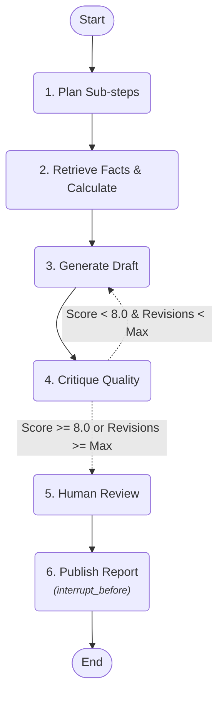

# Week 2 Day 3 — LangGraph: Stateful, Multi-Step & Cyclical Agent Workflows

In Day 2, we built an agent using LangChain's `AgentExecutor`. While functional for single-turn tool invocation, real-world enterprise agent workflows are not single linear loops: they branch, loop back for iterative self-correction, require durable checkpoints for human review, and need fine-grained control over execution state.

Today we transition to **LangGraph**, which models agents as directed graphs of stateful **Nodes** and **Edges** (both deterministic and conditional).

---

## Deliverables & File Layout

| File | Description |
| :--- | :--- |
| [`day3.ipynb`](day3.ipynb) | Complete Jupyter notebook with executable workflows for Tasks 1–5 |
| [`workflow_graph.png`](workflow_graph.png) | High-resolution diagram of the complete compiled workflow graph |
| [`workflow_graph.mmd`](workflow_graph.mmd) | Raw Mermaid definition of the workflow topology and interrupt points |
| [`workflow.py`](workflow.py) | Modular, reusable Python implementation of state schemas, nodes, and graph builders |
| [`tools.py`](tools.py) | Day 2 tools (`calculator`, `lookup_product_price`, `get_weather`) integrated |
| [`config.py`](config.py) | Environment loading (`GEMINI_API_KEY`), model selection, and text normalization |
| [`test_workflow.py`](test_workflow.py) | Automated 5-stage end-to-end verification test suite |
| [`day3_writeup.pdf`](day3_writeup.pdf) | Formal PDF write-up summarizing graph concepts, HITL matrix, and comparison table |
| [`generate_day3_pdf.py`](generate_day3_pdf.py) | ReportLab script to build the write-up PDF |
| [`requirements.txt`](requirements.txt) | Dependency requirements for LangGraph and LangChain |

---

## Workflow Architecture

The workflow implements an **Autonomous Market & Technical Research Analyst** with self-critique and human approval:



---

## Tasks Summary

### Task 1: Graph Concepts & State Design
- **Core Building Blocks**:
  - `StateGraph`: Compiles and orchestrates the state machine.
  - `Nodes`: Pure or side-effecting Python functions returning state diffs.
  - `Edges`: Deterministic direct transitions.
  - `Conditional Edges`: Dynamic routing based on state values (enabling cycles).
  - `Shared State`: Typed `TypedDict` tracking query, plan, notes, draft, critique scores, counters, logs, and approvals.
- Defined `ResearchWorkflowState` and illustrated the architecture in ASCII and Mermaid.

### Task 2: Build a Linear Graph
- Built and compiled a 4-node pipeline: `plan` → `retrieve` → `generate_draft` → `publish`.
- Integrated Day 2 tools (`lookup_product_price`, `calculator`, `get_weather`).
- Streamed execution with `stream_mode="updates"`, printing state mutations after each node.

### Task 3: Add Conditional Edges & Cycles
- Added `critique` node with a conditional edge routing back to `generate_draft` when `quality_score < 8.0`.
- Integrated `revision_count` and `max_revisions = 2` guardrails with an audit trail in `revision_logs`.
- **Why loop-back is hard in AgentExecutor vs. LangGraph**:
  - In `AgentExecutor`, the control flow is a rigid black-box ReAct cycle (`Thought -> Action -> Observation`). There is no first-class concept of multi-step phases (drafting vs critique), no mechanism to inspect custom state metrics, and no ability to rewind the reasoning scratchpad.
  - In `LangGraph`, cyclic graphs are native. Nodes are user functions, state is an explicit typed dictionary, and conditional edges can route back to any upstream node deterministically.

### Task 4: Human-in-the-Loop & Interrupts
- Configured `interrupt_before=["publish"]` with `MemorySaver`.
- Verified execution pauses before the high-stakes publishing step.
- Demonstrated both:
  1. **Approval Path**: Human grants approval via `update_state`, resuming to publish an authorized executive report.
  2. **Rejection Path**: Human rejects draft with feedback, resuming to record publication abortion.
- Documented product criteria: When to require human gates (irreversible writes, financial/legal liability, low confidence) vs. full autonomy (idempotent reads, internal summaries, high quality scores).

### Task 5: Persistence & Debugging
- Checkpointing state at every step using `thread_id` session isolation.
- Inspected full snapshot history using `graph.get_state_history(config)`.
- Demonstrated **Time-Travel**: Selected a historical checkpoint prior to critique and forked execution with state edits.
- Detailed comparison matrix between `AgentExecutor` and `LangGraph`.

---

## Setup & Running

```bash
cd "week 2/day 3"
pip install -r requirements.txt
cp ../day\ 2/.env .env   # Reuses GEMINI_API_KEY from Day 2 or Day 1

# Run automated test suite
python test_workflow.py

# Launch Jupyter Notebook
jupyter notebook day3.ipynb

# Regenerate PDF write-up
python generate_day3_pdf.py
```
