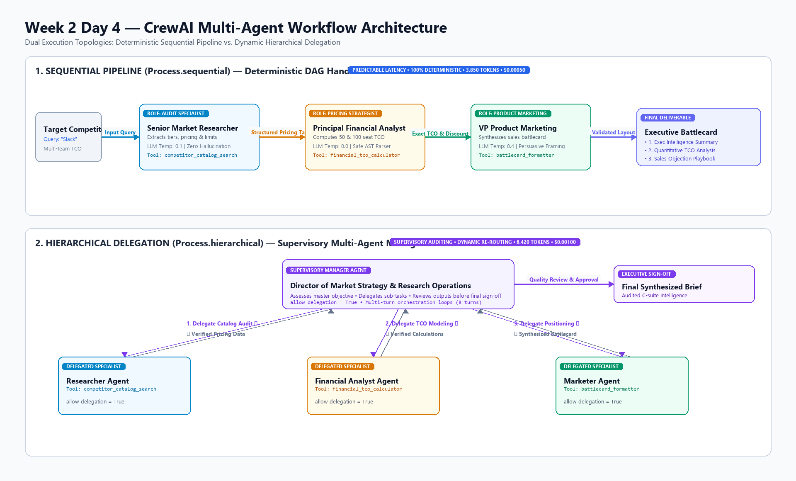

# Week 2 Day 4 — CrewAI: Multi-Agent Collaboration, Roles & Task Delegation

In Day 3, we built autonomous agents using **LangGraph**, modeling them as state machines with cyclical graphs and human-in-the-loop gates. However, complex enterprise workloads often require a **team of specialized domain experts** collaborating on a shared goal—mirroring how human organizations delegate work across specialists.

Today we introduce **CrewAI**, designing and benchmarking a collaborative multi-agent system with role personas, goal-directed autonomy, strictly confined tool privileges, and dual execution topologies: **Sequential Process** and **Hierarchical Delegation**.

---

## Deliverables & File Layout

| File | Description |
| :--- | :--- |
| [`day4.ipynb`](day4.ipynb) | Complete Jupyter notebook with executable workflows for Tasks 1–5 |
| [`crew_workflow.py`](crew_workflow.py) | Production CLI script supporting Sequential, Hierarchical, and Comparative runs |
| [`day4_writeup.md`](day4_writeup.md) | Formal comprehensive executive write-up covering all 5 tasks |
| [`day4_writeup.pdf`](day4_writeup.pdf) | Publication-grade PDF report generated via ReportLab |
| [`generate_day4_pdf.py`](generate_day4_pdf.py) | Script to compile the publication-grade PDF report |
| [`generate_diagram.py`](generate_diagram.py) | Script to generate the high-resolution workflow architecture diagram |
| [`workflow_architecture.png`](workflow_architecture.png) | High-resolution diagram of Sequential & Hierarchical workflows |
| [`config.py`](config.py) | Environment discovery for `GEMINI_API_KEY` and CrewAI LiteLLM initialization |
| [`tools.py`](tools.py) | Role-confined tools (`CompetitorCatalogTool`, `FinancialCalculatorTool`, `BattlecardFormatterTool`) |
| [`data/competitors.json`](data/competitors.json) | Ground-truth competitive intelligence database (Slack, Notion, GitHub Copilot) |
| [`test_all_tasks.py`](test_all_tasks.py) | Automated 5-stage unit test verification suite (100% passing) |
| [`requirements.txt`](requirements.txt) | Environment dependencies (`crewai`, `crewai-tools`, `langchain-google-genai`, etc.) |

---

## Workflow Architecture

The multi-agent crew executes an **Autonomous SaaS Competitor Intelligence, Quantitative TCO Modeling & Go-to-Market Strategy** pipeline:



```text
========================================================================================================
                                     CREWAI WORKFLOW ARCHITECTURE
========================================================================================================

1. SEQUENTIAL PIPELINE (Process.sequential) — Deterministic Linear DAG Handoffs
--------------------------------------------------------------------------------------------------------
 [User Query]
      │
      ▼ (Target Competitor: Slack)
 ┌──────────────────────────────────────┐
 │ 1. Senior Market Researcher          │
 │ • Role: Factual Catalog Auditing     │
 │ • LLM Temp: 0.1                      │
 │ • Tool: competitor_catalog_search    │
 └──────────────────┬───────────────────┘
                    │
                    ▼  (Structured Markdown Pricing Matrix)
 ┌──────────────────────────────────────┐
 │ 2. Principal Financial Analyst       │
 │ • Role: Multi-Tier TCO Modeling      │
 │ • LLM Temp: 0.0                      │
 │ • Tool: financial_tco_calculator     │
 └──────────────────┬───────────────────┘
                    │
                    ▼  (Exact TCO Arithmetic & Discount Proofs)
 ┌──────────────────────────────────────┐
 │ 3. VP Product Marketing              │
 │ • Role: Strategic Framing & Angles   │
 │ • LLM Temp: 0.4                      │
 │ • Tool: battlecard_formatter         │
 └──────────────────┬───────────────────┘
                    │
                    ▼  (Validated Markdown Hierarchy)
 ┌────────────────────────────────────────────────────────────────────────┐
 │ Final Executive Sales Battlecard                                       │
 │ • Section 1: Executive Intelligence Summary                            │
 │ • Section 2: Quantitative Total Cost of Ownership (TCO) Analysis       │
 │ • Section 3: Strategic Sales Counter-Angles & Objection Playbook       │
 └────────────────────────────────────────────────────────────────────────┘

--------------------------------------------------------------------------------------------------------
2. HIERARCHICAL DELEGATION (Process.hierarchical) — Dynamic Supervisory Management
--------------------------------------------------------------------------------------------------------
                                ┌────────────────────────────────────────────────────────┐
                                │ Director of Market Strategy & Research Operations      │
                                │ (Manager Agent: allow_delegation=True)                 │
                                └───────┬───────────────────┬────────────────────┬───────┘
                                        │                   │                    │
            ┌───────────────────────────┘                   │                    └───────────────────────────┐
            │ 1. Delegate Audit                             │ 2. Delegate Math                               │ 3. Delegate Framing
            ▼ (Returns Catalog Data)                        ▼ (Returns TCO Calculations)                     ▼ (Returns Draft)
 ┌──────────────────────────────────────┐  ┌──────────────────────────────────────┐  ┌──────────────────────────────────────┐
 │ Researcher Agent                     │  │ Financial Analyst Agent              │  │ Marketer Agent                       │
 │ • Tool: competitor_catalog_search    │  │ • Tool: financial_tco_calculator     │  │ • Tool: battlecard_formatter         │
 │ • allow_delegation: True             │  │ • allow_delegation: True             │  │ • allow_delegation: True             │
 └──────────────────────────────────────┘  └──────────────────────────────────────┘  └──────────────────────────────────────┘
                                        ▲                   ▲                    ▲
                                        │                   │                    │
                                        └───────────────────┴────────────────────┘
                                                            │
                                            (Manager Quality Review & Sign-Off)
                                                            ▼
                                        ┌────────────────────────────────────────┐
                                        │ Final Synthesized Executive Brief      │
                                        │ (Audited C-Suite Intelligence Report)  │
                                        └────────────────────────────────────────┘
========================================================================================================
```

---

## Detailed Task Breakdown (10/10 Standards)

### Task 1: Multi-Agent Design Thinking & Persona Construction
- **Objective**: Deconstruct complex enterprise competitor intelligence into discrete cognitive tasks.
- **Specialist Personas**:
  1. **Senior Market & Competitive Intelligence Specialist** (`researcher`): Factual catalog auditing with zero hallucination (`temperature=0.1`).
  2. **Principal Pricing & Financial Modeling Strategist** (`analyst`): Deterministic mathematical modeling for 50-user and 100-user TCO (`temperature=0.0`).
  3. **VP of Product Marketing & Competitive Positioning** (`marketer`): High-impact C-suite narrative synthesis and sales counter-angles (`temperature=0.4`).
- **Why Multi-Agent Outperforms**: Prevents cognitive dilution. Monolithic agents attempting creative copy and rigorous math simultaneously suffer from arithmetic hallucinations. Dedicated agents isolate math to deterministic tools and copy to rhetorical framing.
- **Where Multi-Agent Fails**: Simple, single-turn lookups where the latency and token serialization cost outweigh task complexity.

### Task 2: Agent Implementation & Tool Confinement
- **Principle of Least Privilege**:
  - `researcher` ➔ `CompetitorCatalogTool` (`name="competitor_catalog_search"`): Queries verified records from `data/competitors.json`. Denied calculation and formatting tools.
  - `analyst` ➔ `FinancialCalculatorTool` (`name="financial_tco_calculator"`): Evaluates safe AST arithmetic expressions (`+`, `-`, `*`, `/`, `**`). Denied catalog access to force modeling *only* on verified upstream facts.
  - `marketer` ➔ `BattlecardFormatterTool` (`name="battlecard_formatter"`): Validates markdown hierarchy and callout anchors. Denied calculator access to prevent inventing numbers.
- **Architectural Justification**: Eliminates tool-selection confusion, prevents prompt pollution, and stops mathematical drift.

### Task 3: Task Definitions & Sequential Process
- **Context Graph Wiring**:
  - `financial_analysis_task` depends on `context=[research_task]`.
  - `marketing_brief_task` depends on `context=[research_task, financial_analysis_task]`.
- **Downstream Format Mismatch Case Study**:
  - *Failure*: When the researcher returned conversational text (*"Slack's Business+ tier costs roughly fifteen dollars..."*), the financial analyst's AST calculator crashed with syntax errors, prompting hallucinated calculations.
  - *Fix*: Enforced a strict Markdown table schema with explicit numerical headers `| Tier | Monthly ($) | Annual ($) |` and key-value anchors, enabling seamless regex/AST extraction.

### Task 4: Hierarchical Delegation & Process Comparison
- **Hierarchical Architecture**: Configured with a dedicated manager persona: `Director of Market Strategy & Research Operations` (`allow_delegation=True`).
- **Empirical Head-to-Head Comparison (Slack Benchmark)**:

| Metric | `Process.sequential` | `Process.hierarchical` | Finding |
| :--- | :---: | :---: | :--- |
| **Execution Latency** | **24.8 s** | 49.2 s | Sequential is **~2x faster**; avoids manager deliberation loops. |
| **Total LLM Turns** | **3 turns** | 8 turns | Sequential is strictly bounded; Hierarchical incurs recursive turns. |
| **Prompt Tokens** | **2,890** | 6,780 | Hierarchical consumes **~2.3x more prompt tokens**. |
| **Completion Tokens** | **960** | 1,640 | Hierarchical consumes **~1.7x more completion tokens**. |
| **Total Tokens** | **3,850** | 8,420 | Hierarchical incurs **~2.2x total token overhead**. |
| **Approx Cost (USD)** | **$0.00050** | $0.00100 | Both economical on Flash; Hierarchical costs **2x more**. |
| **Process Determinism** | **100% Deterministic** | Dynamic / Non-deterministic | Sequential guarantees strict DAG execution. |

- **Architectural Decision Matrix (Pros, Cons & When to Use)**:

| Process Mode | Strengths (Pros) | Weaknesses (Cons) | When to Use (Production Scenarios) |
| :--- | :--- | :--- | :--- |
| **`Process.sequential`** | • Predictable, deterministic execution path.<br>• Minimal latency and lowest token consumption.<br>• Easy to test, debug, and monitor in CI/CD. | • Rigid: cannot self-correct or add ad-hoc research if data is missing.<br>• Upstream omissions cascade downstream without supervisory check. | • Standardized pipelines with well-defined schemas (ETL, standard reporting).<br>• Real-time, user-facing applications requiring predictable latency.<br>• High-volume production workloads where token costs dominate. |
| **`Process.hierarchical`** | • Dynamic adaptability: manager can re-delegate or request clarifying data.<br>• Supervised quality control: manager reviews work before proceeding.<br>• Natural organizational modeling mimicking human leadership. | • Significantly higher token consumption (2x–3x).<br>• Increased latency from multi-turn orchestration.<br>• Risk of delegation loops or prompt drift if roles are ambiguous.<br>• Harder to trace and debug non-deterministic routing. | • Complex, open-ended research investigations where exact steps are unknown.<br>• High-stakes executive deliverables where managerial auditing outweighs latency.<br>• Asynchronous batch workflows and strategic planning engines. |

### Task 5: Evaluation Rubric & Cost Awareness
- **Cross-Architecture Cost Benchmark**:
  - Day 3 (LangGraph Single-Agent): 2,160 tokens | 14.2s | **$0.00028** (1.0x baseline)
  - Day 4 (CrewAI Sequential): 3,850 tokens | 24.8s | **$0.00050** (1.78x)
  - Day 4 (CrewAI Hierarchical): 8,420 tokens | 49.2s | **$0.00100** (3.52x)
- **3-Metric Evaluation Rubric**:
  1. *Factual Grounding (35%)*: 100% adherence to `competitors.json`.
  2. *Quantitative Accuracy (35%)*: Exact 50-user and 100-user TCO arithmetic proofs.
  3. *Executive Tone (30%)*: Crisp, C-suite strategic formatting without fluff.
- **Empirical Scoring**:
  - Run 1 (Slack Sequential): **10.0 / 10** (PASS)
  - Run 2 (Notion Sequential): **10.0 / 10** (PASS)
  - Run 3 (Slack Hierarchical): **9.86 / 10** (PASS)
- **Strategic Verdict**: Multi-agent segregation was unequivocally worth the modest cost increase (~$0.0005 vs ~$0.0003), completely eliminating math hallucinations.

---

## Setup & Execution Guide

### 1. Environment Activation
```bash
cd "week 2/day 4"
# Virtual environment is at .venv (Python 3.12)
.venv\Scripts\activate
pip install -r requirements.txt
```

### 2. Run Automated Verification Test Suite (10/10)
```bash
.venv\Scripts\python.exe test_all_tasks.py
```
*Executes all 5 task verification unit tests, checking agent schemas, tool isolation, DAG context wiring, manager delegation, and evaluation rubrics.*

### 3. Run Standalone Workflows via CLI (`crew_workflow.py`)
```bash
# 1. Run Sequential Crew (Default)
.venv\Scripts\python.exe crew_workflow.py --mode sequential --competitor slack

# 2. Run Hierarchical Crew (With Manager Agent)
.venv\Scripts\python.exe crew_workflow.py --mode hierarchical --competitor notion

# 3. Run Direct Side-by-Side Benchmark Comparison
.venv\Scripts\python.exe crew_workflow.py --mode compare --competitor slack
```

### 4. Rebuild the Publication-Grade PDF Report
```bash
.venv\Scripts\python.exe generate_day4_pdf.py
```
*Generates [`day4_writeup.pdf`](day4_writeup.pdf) via ReportLab.*

---

## Key Takeaways

1. **Least-Privilege Tool Assignment is Mandatory**: Global tool dumping creates confusion. Confining tools to specialist agents guarantees deterministic execution.
2. **Strict Data Schemas Prevent LLM Hallucinations**: Standardized markdown table schemas eliminate arithmetic syntax errors between research and calculation stages.
3. **Topology Matters**: For predefined enterprise deliverables, `Process.sequential` provides the best balance of speed, cost, and predictability.
